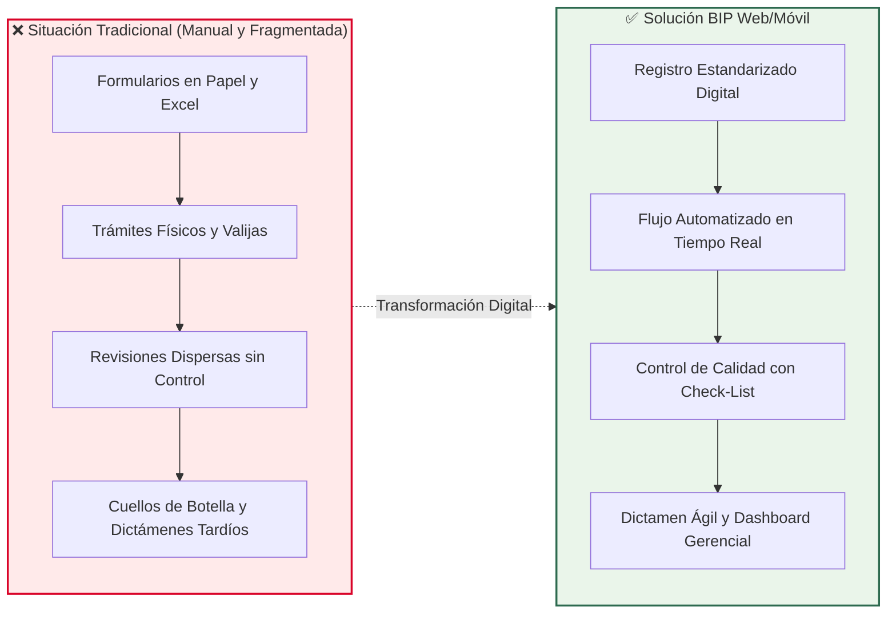
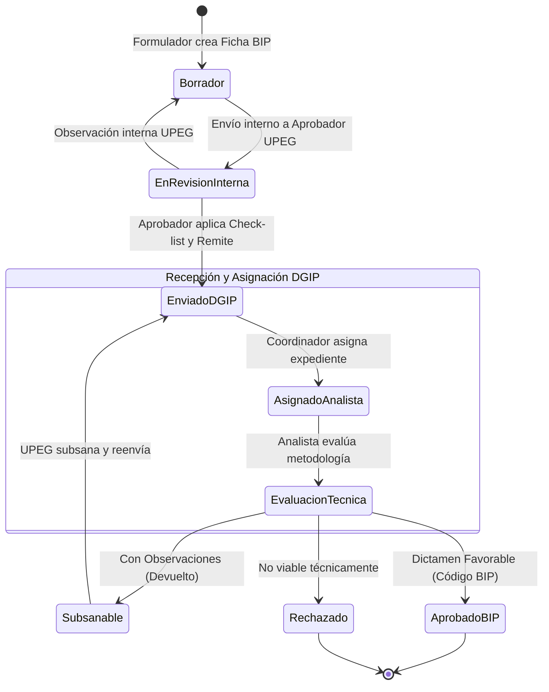
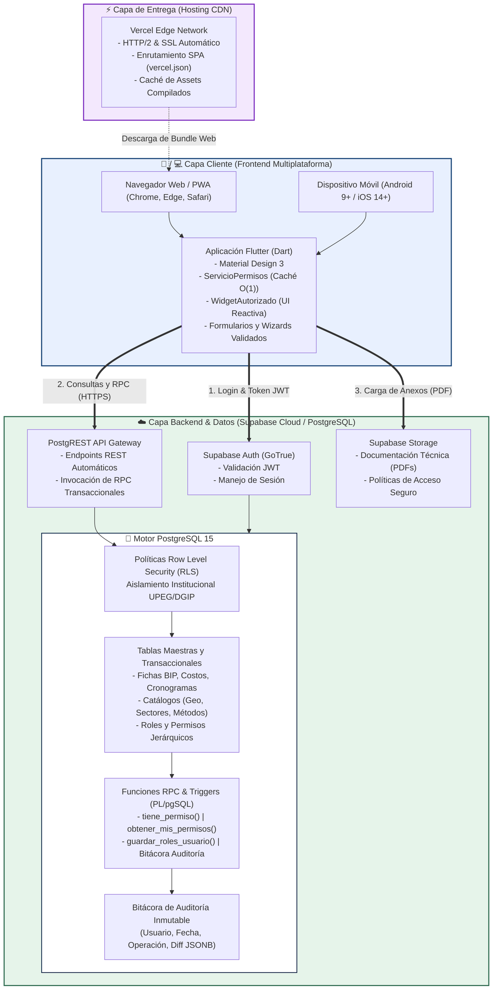
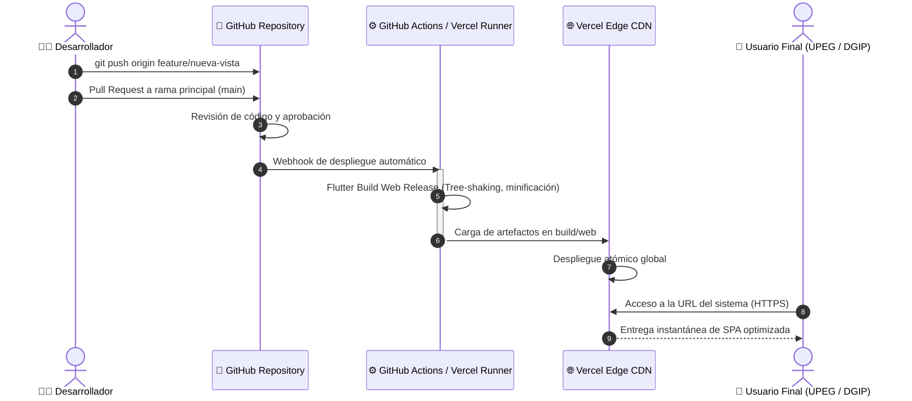
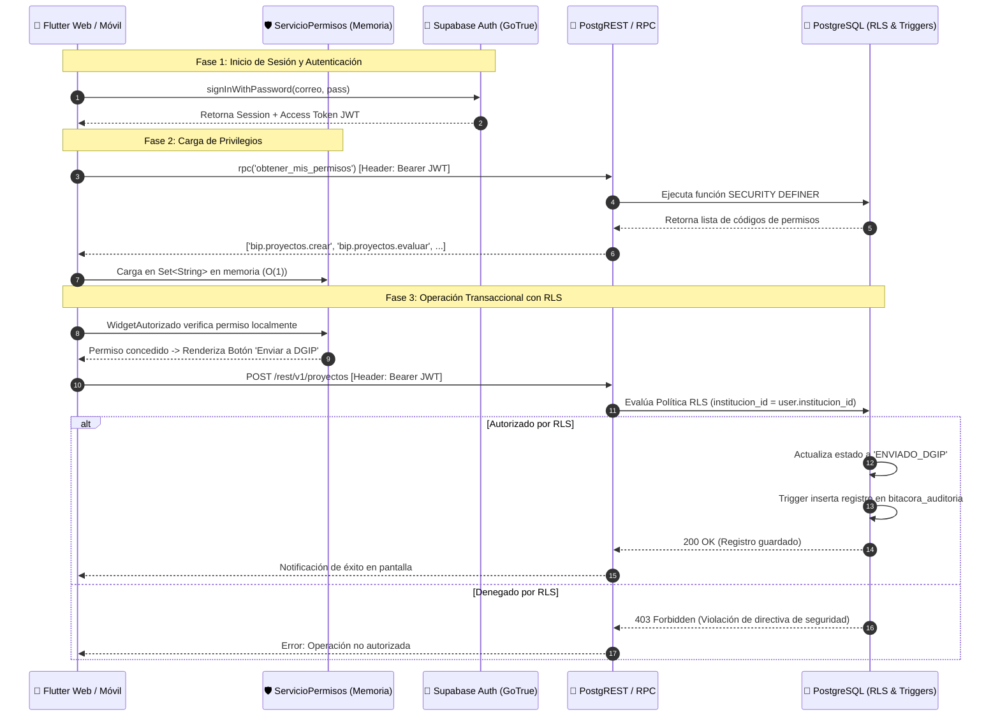

# Documento Ejecutivo y Técnico: Sistema BIP (Banco Integrado de Proyectos)
**Sistema de Gestión y Banco Integrado de Proyectos de Inversión Pública (BIP Web / Móvil)**  
*Secretaría de Finanzas (SEFIN) / Dirección General de Inversiones Públicas (DGIP) / Unidad de Preinversión*  
*Equipo 4 – Programación Móvil*

---

> **Guía para Gemini Spark / Generador de Presentaciones**:  
> Este documento está estructurado por secciones modulares que corresponden a láminas/diapositivas (`Slides`). Cada sección incluye objetivos clave, viñetas de alto impacto, diagramas visuales en sintaxis Mermaid y notas de apoyo para el orador.

---

## Slide 1: Portada y Presentación del Proyecto

* **Título:** Sistema de Gestión y Banco Integrado de Proyectos de Inversión Pública (BIP Web / Móvil)
* **Subtítulo:** Modernización, Digitalización y Trazabilidad del Ciclo de Preinversión Nacional
* **Entorno Rector:** Secretaría de Finanzas (SEFIN) & Dirección General de Inversiones Públicas (DGIP)
* **Equipo de Desarrollo (Equipo 4):**
  * Hugo Zúniga (Líder / Seguridad, RBAC y Catálogos)
  * Naomi Zaldaña (Diseño UI/UX / Ficha de Registro y Formulación)
  * Jaime Padilla (Calidad, Bandejas de Evaluación y Ciclo DGIP)
  * Rolando Soto (Dashboard Gerencial, Analítica y Exportación)
* **Año / Versión:** 2026 | Versión 1.0

---

## Slide 2: La Problemática (Situación Actual)

### Contexto del Problema
En el sector público hondureño, la formulación y evaluación de proyectos de inversión atraviesa múltiples instituciones (UPEGs) antes de recibir financiamiento de la DGIP/SEFIN. Actualmente, este proceso adolece de fricciones operativas críticas:

* **Dispersión y Uso de Papel / Hojas de Cálculo:** Fichas técnicas heterogéneas, sin estandarización de costos, indicadores socioeconómicos o georreferenciación.
* **Falta de Trazabilidad y Transparencia:** Tiempos muertos en la entrega física de expedientes; se desconoce en qué escritorio o etapa se encuentra una iniciativa.
* **Cuellos de Botella en el Control de Calidad:** Revisiones manuales repetitivas que retrasan semanas la emisión de dictámenes de preinversión.
* **Riesgo en la Toma de Decisiones:** Los tomadores de decisiones no cuentan con información consolidada en tiempo real de la cartera de inversión pública nacional.

---

## Slide 3: Objetivos del Sistema

### Objetivo General
Desarrollar e implementar una plataforma tecnológica multiplataforma (Web y Móvil) para la Secretaría de Finanzas (SEFIN/DGIP) que digitalice, estandarice y agilice el registro, control de calidad, evaluación metodológica y seguimiento de iniciativas de inversión pública en Honduras.

### Objetivos Específicos
1. **Digitalizar la Ficha Técnica BIP:** Proveer un asistente guiado (wizard) con captura estructurada de datos generales, componentes, costos dinámicos, metas físicas y georreferenciación UTM.
2. **Implementar Gobernanza de Acceso (RBAC):** Restringir y auditar las operaciones mediante control de acceso granular basado en roles a nivel institucional y rector.
3. **Estandarizar el Control de Calidad Institucional:** Integrar listas de chequeo técnicas (check-lists) obligatorias antes del envío a la DGIP.
4. **Agilizar el Dictamen Técnico:** Proveer bandejas digitales para asignación y resolución técnica con dictámenes normados (*Aprobado, Observado o Rechazado*).
5. **Visibilidad Ejecutiva en Tiempo Real:** Ofrecer un Dashboard analítico con indicadores macro (KPIs de monto invertido, distribución geográfica y sectorial) y exportación oficial en PDF/Excel.

---

## Slide 4: ¿Qué Hace el Programa? (Funcionalidades Clave y Actores)

El sistema BIP opera como un ecosistema colaborativo que conecta dos niveles de dominio gubernamental:

| Dominio | Actor / Rol | Funcionalidad Principal |
| :--- | :--- | :--- |
| **Institucional (UPEG)** | **Formulador UPEG** | Registra fichas de proyecto en borrador, componentes de costos, cronogramas, beneficiarios y sube documentos técnicos (PDFs hasta 10MB). |
| **Institucional (UPEG)** | **Aprobador UPEG** | Aplica la lista de chequeo institucional y realiza la remisión formal a DGIP (bloqueando ediciones no autorizadas). |
| **Rector (DGIP / SEFIN)** | **Coordinador DGIP** | Monitorea la bandeja general de solicitudes entrantes y asigna expedientes a los analistas según carga de trabajo. |
| **Rector (DGIP / SEFIN)** | **Analista Técnico** | Evalúa la metodología socioeconómica (VPN, TIR, B/C, CAE) y emite dictámenes vinculantes con observaciones subsanables. |
| **Rector / Estratégico** | **Director DGIP** | Consulta tableros gerenciales consolidando la cartera nacional por sector, fuente de financiamiento y ubicación territorial. |
| **Transversal** | **Administrador** | Administra usuarios, perfiles, asignación de roles y mantiene los catálogos maestros (geográficos, sectores, metodologías). |

---

## Slide 5: Arquitectura Tecnológica Utilizada

La solución adopta una **Arquitectura Serverless Reactiva Multiplataforma**, diseñada para maximizar rendimiento, alta disponibilidad (99.5%) y coste cero en infraestructura base:

* **Capa Cliente (Frontend):** **Flutter Web & Móvil (Dart 3.x)**.
  * Renderizado mediante Single Page Application (SPA) responsiva (adaptable de 5" a 11"+ y pantallas de escritorio).
  * Patrón de diseño con arquitectura limpia, componentes desacoplados y estado reactivo.
  * Control de acceso en la UI mediante `WidgetAutorizado` y caché en memoria (`ServicioPermisos`) con evaluación en $O(1)$.
* **Capa de Servicios y Base de Datos (Backend / BaaS):** **Supabase**.
  * **Motor Relacional:** PostgreSQL 15 con extensiones geoespaciales y JSONB.
  * **Motor de Identidad:** Supabase Auth (GoTrue) emitiendo tokens criptográficos JWT.
  * **Capa de Seguridad Nativa:** Políticas de **Row Level Security (RLS)** a nivel de base de datos para aislamiento multitenant estricto (una UPEG no puede leer ni modificar proyectos de otra).
  * **Lógica Transaccional:** Procedimientos almacenados (`SECURITY DEFINER` RPC) y Triggers en PL/pgSQL para auditoría automática y creación de perfiles.
  * **Almacenamiento de Archivos:** Supabase Storage (S3 compatible) para expedientes y anexos PDF.
* **Capa de Despliegue y CDN:** **Vercel Edge Network**.
  * Servido de activos estáticos web compilados (WASM/CanvasKit, JS, CSS, Assets) a través de nodos distribuidos globalmente con latencia mínima.

---

## Slide 6: Diagrama Integral de Arquitectura

---

## Slide 7: Ciclo de Integración y Despliegue Continuo (CI/CD con GitHub y Vercel)

El proyecto cuenta con un flujo moderno de ingeniería de software con integración continua y despliegue continuo (CI/CD):

1. **Gestión de Versiones en GitHub:**
   * Rama `main`: Código protegido para producción.
   * Rama `develop`: Rama integradora de equipo.
   * Ramas funcionales (`feature/auth-rbac`, `feature/ficha-registro`, etc.) para trabajo paralelo sin bloqueos.
2. **Pipeline Automatizado de Despliegue:**
   * Cada push o merge a la rama principal dispara un webhook seguro hacia Vercel.
   * Vercel ejecuta la compilación del bundle web optimizado (`flutter build web --release`).
   * Despliegue atómico con Zero-Downtime y reescritura de rutas configurada en [`vercel.json`](file:///Users/hugozuniga/development/Proyecto%20Programacion%20Movil/proyecto_programacion_movil_grupo_4/vercel.json) para soportar navegación SPA.
3. **Control de Calidad en Código:**
   * Análisis estático de linting mediante Dart Analyzer (`analysis_options.yaml`).
   * Pruebas unitarias de modelos y validadores de cálculo financiero.

---

## Slide 8: Conectividad y Protocolo de Comunicación (Frontend <-> Supabase)

La comunicación entre el cliente Flutter y los servicios en la nube de Supabase opera mediante estándares abiertos de alta seguridad:

1. **Autenticación Basada en Tokens JWT:**
   * Al autenticarse con correo y contraseña, Supabase valida las credenciales y genera un par de tokens (Access Token JWT y Refresh Token).
   * Cada solicitud HTTP subsiguiente incluye el encabezado estándar: `Authorization: Bearer <JWT>`.
2. **Resolución de Permisos en el Cliente:**
   * Al iniciar sesión, el servicio [`ServicioPermisos`](file:///Users/hugozuniga/development/Proyecto%20Programacion%20Movil/proyecto_programacion_movil_grupo_4/lib/core/security/servicio_permisos.dart) invoca la RPC `obtener_mis_permisos()`.
   * Los permisos se almacenan en un `Set<String>` en memoria RAM del dispositivo, garantizando comprobaciones inmediatas en la interfaz sin latencia de red.
3. **Filtro de Seguridad en Base de Datos (RLS):**
   * Aunque un usuario malicioso intentara forzar la API, PostgreSQL intercepta la consulta en el servidor, extrae el `auth.uid()` del token y aplica las políticas RLS.
   * Si el usuario no pertenece a la institución del proyecto, la base de datos rechaza la operación con código de acceso denegado.
4. **Manejo de Transacciones Críticas:**
   * Las operaciones complejas (ej. asignación múltiple de roles, cambio formal de estado de un proyecto con bitácora) se ejecutan mediante funciones RPC atómicas en PostgreSQL, garantizando integridad referencial ACID.

---

## Slide 9: Resumen de Valor e Impacto

| Dimensión | Antes (Proceso Manual) | Con el Sistema BIP Web / Móvil |
| :--- | :--- | :--- |
| **Tiempo de Trámite** | 4 a 8 semanas por ciclo de revisión | Reducción de hasta un 65% en emisión de dictámenes |
| **Integridad de Datos** | Hojas de cálculo con fórmulas rotas | Esquema relacional estricto con validaciones en cascada |
| **Seguridad y Acceso** | Claves compartidas o sin control | RBAC multinivel, JWT, RLS nativo y Bitácora de auditoría |
| **Disponibilidad** | Archiveros físicos en horario de oficina | Acceso 24/7 multiplataforma vía CDN y Cloud Serverless |
| **Toma de Decisiones** | Reportes estáticos desfasados | Dashboard en tiempo real con distribución territorial y sectorial |

---

## Slide 10: Conclusión y Próximos Pasos

* **Logro Principal:** Entrega de un producto digital funcional, modular y normativamente alineado con los requerimientos de la Dirección General de Inversiones Públicas (DGIP) y la SEFIN.
* **Aspectos Técnicos Destacados:**
  * Uso de tecnologías modernas, estables y sin costo de licencias de software (Open Source + Serverless).
  * Arquitectura escalable y mantenible con separación clara de responsabilidades por módulos.
  * Pipeline automatizado desde el código fuente hasta la entrega en la nube.
* **Líneas Futuras:**
  * Incorporación de firma electrónica avanzada institucional.
  * Módulo de seguimiento físico-financiero en la etapa de ejecución de obras.
  * App móvil offline-first para visitas técnicas y levantamiento de campo en zonas sin cobertura.
