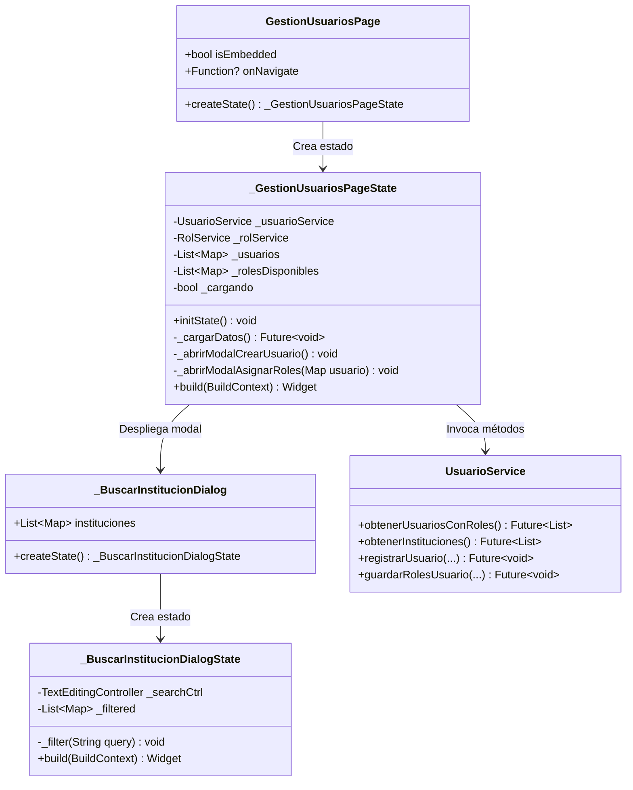
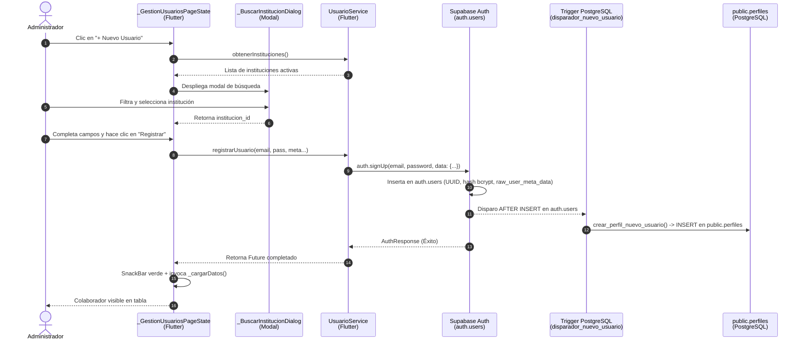

# Explicación Técnica y Conceptual: Gestión y Registro de Usuarios en `gestion_usuarios_page.dart`
**Proyecto:** Banco de Iniciativas de Proyectos (BIP-SNIPH)  
**Tecnologías:** Flutter (Dart) + Supabase (Auth, PostgreSQL 17, PL/pgSQL, Triggers)  
**Archivo Principal:** [`lib/features/security/presentation/paginas/gestion_usuarios_page.dart`](file:///Users/hugozuniga/development/Proyecto%20Programacion%20Movil/proyecto_programacion_movil_grupo_4/lib/features/security/presentation/paginas/gestion_usuarios_page.dart)

---

## 1. Fundamentos Conceptuales de Dart y Flutter en el Módulo

### 1.1. ¿Qué es `List<Map<String, dynamic>>`?
En Dart, esta estructura de datos representa una colección dinámica de registros provenientes de la base de datos o APIs:
* **`Map<String, dynamic>`**: Es un diccionario de clave-valor (similar a un objeto JSON `{ "campo": "valor" }`).
  * La **clave** (`String`) siempre es un texto que identifica la columna o atributo (por ejemplo: `'nombres'`, `'apellidos'`, `'cargo'`, `'instituciones'`).
  * El **valor** (`dynamic`) puede ser de cualquier tipo en tiempo de ejecución: una cadena de texto (`String`), un número entero (`int`), un booleano (`bool`), `null`, o incluso otro mapa anidado (por ejemplo, `instituciones: { 'id': '...', 'nombre': '...' }`).
* **`List<...>`**: Es un arreglo ordenado de elementos.
* **Uso en el código:**
  ```dart
  List<Map<String, dynamic>> _usuarios = [];
  List<Map<String, dynamic>> _rolesDisponibles = [];
  ```
  `_usuarios` almacena en memoria la lista de colaboradores con sus datos personales, su entidad y sus roles asignados. Trabajar directamente con `Map<String, dynamic>` en esta vista permite manipular fácilmente las respuestas relacionales con `JOIN` que entrega el SDK de Supabase sin necesidad de parsear modelos rígidos intermedios.

---

### 1.2. ¿Qué es `Future<void>`, `async` y `await`?
Dart es un lenguaje que se ejecuta sobre un único hilo principal de ejecución (*Event Loop*). Cualquier tarea pesada (como consultar una base de datos a través de Internet) bloquearía la pantalla si se ejecutara de forma síncrona.

* **`Future<T>`**: Representa una promesa de que un resultado estará disponible más adelante ("en el futuro").
* **`Future<void>`**: Indica que el método realiza una operación asíncrona, pero que al finalizar **no retorna ningún valor**, solo avisa a quien lo llamó que la tarea concluyó satisfactoriamente o arrojó una excepción.
* **`async`**: Palabra clave que marca una función para que pueda ejecutar tareas asíncronas y utilizar `await`.
* **`await`**: Detiene temporalmente la ejecución secuencial de la función actual hasta que la promesa (`Future`) se resuelva (por ejemplo, esperando la respuesta de Supabase), **sin congelar la interfaz gráfica ni los toques del usuario**.

---

### 1.3. ¿Qué hace `setState(() { ... })`?
En Flutter, los objetos de estado no redibujan la pantalla automáticamente cuando cambian sus variables internas.
* Al envolver la modificación de variables dentro de `setState(() { ... })`:
  ```dart
  setState(() {
    _usuarios = usuarios;
    _rolesDisponibles = roles;
    _cargando = false;
  });
  ```
* Se le notifica al motor de renderizado de Flutter que el estado interno ha mutado. En consecuencia, Flutter programa una nueva ejecución del método `build()`, reemplazando el spinner de carga (`CircularProgressIndicator`) por las tarjetas de usuarios recién recuperadas.

---

### 1.4. Ciclo de Vida: `initState()` y `dispose()`
* **`initState()`**: Se ejecuta **una única vez** cuando el widget se inserta por primera vez en el árbol de widgets. Es el punto ideal para disparar la carga inicial de datos desde la red (`_cargarDatos()`).
* **`dispose()`**: Se ejecuta cuando el widget se destruye de la memoria (por ejemplo, cuando el usuario cierra la pantalla o cambia de sección). Se utiliza para liberar controladores de texto (`_searchCtrl.dispose()`) y evitar fugas de memoria (*memory leaks*).

---

## 2. Clases Declaradas en el Archivo

El archivo [`gestion_usuarios_page.dart`](file:///Users/hugozuniga/development/Proyecto%20Programacion%20Movil/proyecto_programacion_movil_grupo_4/lib/features/security/presentation/paginas/gestion_usuarios_page.dart) define una arquitectura basada en el patrón `StatefulWidget`:



### 2.1. `GestionUsuariosPage` (Línea 8)
* Hereda de `StatefulWidget`. Es la envoltura pública e inmutable de la página.
* Parámetros:
  * `isEmbedded`: Si es `true`, la vista se adapta como pestaña secundaria sin barra superior (`AppBar`) ni menú lateral (`Drawer`), ideal para integrarse en el contenedor principal `NavegacionPrincipalPage`.
  * `onNavigate`: Callback para emitir navegación hacia otras secciones del sistema.

### 2.2. `_GestionUsuariosPageState` (Línea 22)
* Hereda de `State<GestionUsuariosPage>`. Contiene la lógica de negocio y las variables reactivas.
* Instancia los servicios de backend:
  * `final _usuarioService = UsuarioService();`
  * `final _rolService = RolService();`
* Métodos principales:
  * `_cargarDatos()`: Trae usuarios con sus roles e instituciones en paralelo.
  * `_abrirModalCrearUsuario()`: Despliega el formulario para registrar un colaborador.
  * `_abrirModalAsignarRoles()`: Despliega la lista de roles en checkboxes para asociarlos a un usuario seleccionado.

### 2.3. `_BuscarInstitucionDialog` y su Estado (Líneas 400-482)
* Diálogo modal especializado para seleccionar la institución o UPEG del usuario.
* Incorpora un `TextField` con búsqueda reactiva en vivo (`_filter`): conforme el usuario teclea, busca coincidencias por código institucional (ej. `"1.101"`, `"411"`) o por nombre (ej. `"Salud"`, `"Educación"`).
* Al hacer clic sobre una institución de la lista, ejecuta `Navigator.pop(context, inst)` devolviendo el registro seleccionado al formulario principal.

---

## 3. Flujo Funcional Paso a Paso: De Flutter a Supabase



### Paso 1: Validación de Autorización en UI (Líneas 240-246)
Antes de construir los controles, el método `build()` evalúa los privilegios del usuario actual:
```dart
if (!ServicioPermisos().tiene('seguridad.usuarios.consultar')) {
  return const AccesoDenegadoWidget(
    permisoRequerido: 'seguridad.usuarios.consultar',
    tituloSeccion: 'Gestión de Usuarios',
  );
}
```
Si el usuario no tiene la atribución, no puede ver la lista de usuarios ni el botón de registro.

---

### Paso 2: Carga Inicial de Datos (`_cargarDatos()`) (Líneas 36-50)
Al ingresar a la pantalla, `initState()` llama a `_cargarDatos()`:
```dart
Future<void> _cargarDatos() async {
  setState(() => _cargando = true);
  try {
    final usuarios = await _usuarioService.obtenerUsuariosConRoles();
    final roles = await _rolService.obtenerRoles();
    setState(() {
      _usuarios = usuarios;
      _rolesDisponibles = roles;
      _cargando = false;
    });
  } catch (e) {
    setState(() => _cargando = false);
    _mostrarMensaje('Error al cargar datos: $e', esError: true);
  }
}
```
* Hace un `select` compuesto con relaciones en Supabase:
  ```sql
  SELECT id, nombres, apellidos, identidad, celular, cargo, estado,
         instituciones (id, codigo, nombre),
         usuarios_roles (rol_id, roles (id, codigo, nombre))
  FROM perfiles
  ORDER BY fecha_creacion DESC;
  ```

---

### Paso 3: Apertura del Modal de Creación (Líneas 120-192)
Cuando se presiona el botón **"+ Nuevo Usuario"**:
1. Se recuperan las instituciones activas (`obtenerInstituciones()`).
2. Se crean controladores de texto para cada dato:
   * `emailCtrl`: Correo institucional.
   * `passCtrl`: Contraseña inicial.
   * `nombresCtrl` y `apellidosCtrl`: Nombres y apellidos.
   * `identidadCtrl`: DNI / Cédula.
   * `celularCtrl`: Teléfono de contacto.
   * `cargoCtrl`: Cargo en la institución.
3. Se despliega un `showDialog` que contiene el formulario.

---

### Paso 4: Selección de Institución con Búsqueda Reactiva (Líneas 148-176)
El usuario pulsa sobre el selector institucional:
```dart
final seleccion = await showDialog<Map<String, dynamic>>(
  context: context,
  builder: (context) => _BuscarInstitucionDialog(instituciones: instituciones),
);
if (seleccion != null) {
  setModalState(() {
    institucionSeleccionadaId = seleccion['id'];
    institucionSeleccionadaNombre = '${seleccion['codigo']} - ${seleccion['nombre']}';
  });
}
```
Esto asegura que el usuario vincule un UUID válido de la tabla `instituciones` sin errores tipográficos.

---

### Paso 5: Validación y Envío (Líneas 200-222)
Al hacer clic en **"Registrar"**:
1. Valida que `institucionSeleccionadaId`, `emailCtrl` y `passCtrl` no estén vacíos.
2. Cierra el diálogo modal con `Navigator.pop(context)`.
3. Invoca `_usuarioService.registrarUsuario(...)` enviando todos los campos limpios con `.trim()`.

---

### Paso 6: Llamada al SDK de Supabase (`UsuarioService.registrarUsuario`)
En [`usuario_service.dart`](file:///Users/hugozuniga/development/Proyecto%20Programacion%20Movil/proyecto_programacion_movil_grupo_4/lib/features/security/services/usuario_service.dart#L67):
```dart
await _supabase.auth.signUp(
  email: email,
  password: password,
  data: {
    'institucion_id': institucionId,
    'nombres': nombres,
    'apellidos': apellidos,
    'identidad': identidad,
    'celular': celular,
    'cargo': cargo,
  },
);
```
* `email` y `password`: Supabase Auth los recibe para generar la identidad criptográfica y encriptar la clave con algoritmo **bcrypt**.
* `data`: Es un diccionario que viaja empaquetado en la columna JSONB `auth.users.raw_user_meta_data`.

---

### Paso 7: La Transacción Automática en Supabase (Trigger PostgreSQL)
En cuanto la fila se inserta en `auth.users`:
1. El trigger de PostgreSQL `disparador_nuevo_usuario` se ejecuta automáticamente (`AFTER INSERT ON auth.users`).
2. Dispara la función `public.crear_perfil_nuevo_usuario()`:
   ```sql
   CREATE OR REPLACE FUNCTION public.crear_perfil_nuevo_usuario()
   RETURNS trigger LANGUAGE plpgsql SECURITY DEFINER SET search_path TO 'public'
   AS $function$
   BEGIN
     INSERT INTO public.perfiles (
       id, institucion_id, nombres, apellidos, identidad, celular, cargo, estado
     )
     VALUES (
       new.id,
       NULLIF(new.raw_user_meta_data ->> 'institucion_id', '')::uuid,
       COALESCE(new.raw_user_meta_data ->> 'nombres', new.raw_user_meta_data ->> 'nombre', 'Sin Nombre'),
       COALESCE(new.raw_user_meta_data ->> 'apellidos', new.raw_user_meta_data ->> 'apellido', 'Sin Apellido'),
       COALESCE(new.raw_user_meta_data ->> 'identidad', '0000000000000'),
       COALESCE(new.raw_user_meta_data ->> 'celular', new.raw_user_meta_data ->> 'Celular', '0000-0000'),
       COALESCE(new.raw_user_meta_data ->> 'cargo', 'Sin Cargo'),
       'ACTIVO'
     );
     RETURN new;
   END;
   $function$;
   ```
3. **Garantía de Consistencia:** Gracias al trigger, la creación del perfil en la tabla de negocio es atómica y no depende de que el cliente Flutter haga una segunda petición.

---

### Paso 8: Notificación y Recarga en Pantalla (Líneas 217-218)
Una vez que Supabase responde exitosamente:
1. Flutter muestra un mensaje emergente: *"Usuario registrado correctamente."*
2. Ejecuta inmediatamente `_cargarDatos()`.
3. La lista se refresca y el nuevo colaborador aparece en la interfaz con la etiqueta roja **"Sin Roles"**, listo para que el administrador le asigne sus atribuciones mediante el botón **"Asignar Roles"**.
