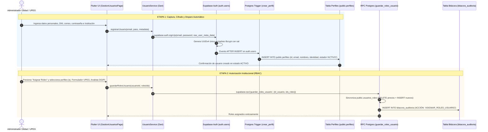
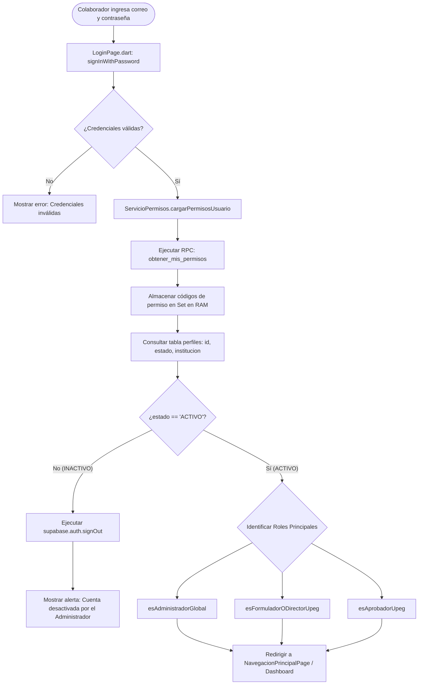

# GUION TÉCNICO Y ARQUITECTURA: CICLO DE VIDA DEL USUARIO
## Sistema de Gestión y Banco Integrado de Proyectos de Inversión Pública (BIP-SNIPH)
### Secretaría de Finanzas (SEFIN) / Dirección General de Inversiones Públicas (DGIP) - Honduras

---

## 1. Resumen Ejecutivo y Propósito
Este documento describe el flujo técnico integral y la arquitectura de seguridad bajo la cual **nace, se aprovisiona, se autoriza y se gestiona un usuario colaborador** en el ecosistema BIP.

El sistema implementa un modelo **RBAC (Role-Based Access Control)** con separación estricta de responsabilidades entre el frontend multiplataforma en **Flutter (Dart)** y el backend transaccional en **Supabase (PostgreSQL + Auth + RLS)**.

---

## 2. Diagrama de Flujo: Nacimiento y Aprovisionamiento del Usuario



---

## 3. Fases Técnicas del Ciclo de Vida

### Fase 1: Captura de Datos en Flutter UI
* **Ubicación:** `lib/features/security/presentation/paginas/gestion_usuarios_page.dart`
* **Mecanismo:** Modal reactivo `_abrirModalCrearUsuario()` con selector modal con búsqueda en vivo de instituciones públicas (`_BuscarInstitucionDialog`).
* **Datos recolectados:**
  1. `email`: Correo institucional oficial del colaborador.
  2. `password`: Contraseña temporal inicial de acceso.
  3. `institucionId`: UUID de la Secretaría, Ente o Municipalidad a la que pertenece.
  4. `nombres` y `apellidos`: Nombre legal del funcionario.
  5. `identidad`: DNI hondureño (13 dígitos).
  6. `celular`: Teléfono de contacto institucional.
  7. `cargo`: Cargo funcional (ej. Formulador Técnico, Director UPEG, Analista).

```dart
// Ejemplo de invocación en Flutter:
await _usuarioService.registrarUsuario(
  email: emailCtrl.text.trim(),
  password: passCtrl.text.trim(),
  institucionId: institucionSeleccionadaId!,
  nombres: nombresCtrl.text.trim(),
  apellidos: apellidosCtrl.text.trim(),
  identidad: identidadCtrl.text.trim(),
  celular: celularCtrl.text.trim(),
  cargo: cargoCtrl.text.trim(),
);
```

---

### Fase 2: Aprovisionamiento en Supabase Auth y Metadatos
* **Ubicación:** `lib/features/security/services/usuario_service.dart`
* El SDK invoca `Supabase.instance.client.auth.signUp()`.
* **Cifrado de Credenciales:** La contraseña jamás se almacena en texto plano ni viaja en logs; el motor de autenticación la transforma con algoritmo **Bcrypt** con costo de sal dinámico.
* **Inyección de Metadatos:** Los campos complementarios se inyectan en el JSON `raw_user_meta_data` dentro de la sesión de autenticación.

```dart
Future<void> registrarUsuario({ ... }) async {
  await _supabase.auth.signUp(
    email: email,
    password: password,
    data: {
      'institucion_id': institucionId,
      'nombres': nombres,
      'apellidos': apellidos,
      'identidad': identidad,
      'celular': celular,
      'cargo': cargo,
    },
  );
}
```

---

### Fase 3: Disparador Transaccional en Base de Datos (PostgreSQL Trigger)
* **Ubicación:** Servidor Supabase (Procedimiento Almacenado `public.crear_perfil_nuevo_usuario`).
* **Seguridad:** Ejecutado con `SECURITY DEFINER` para garantizar que la creación de la ficha de perfil pública se complete de forma atómica e infalible, independientemente de los permisos del cliente.

```sql
CREATE OR REPLACE FUNCTION public.crear_perfil_nuevo_usuario()
RETURNS trigger 
LANGUAGE plpgsql 
SECURITY DEFINER 
SET search_path TO 'public'
AS $$
BEGIN
  INSERT INTO public.perfiles (
    id,
    institucion_id,
    nombres,
    apellidos,
    identidad,
    celular,
    cargo,
    email,
    estado
  )
  VALUES (
    new.id, -- Mismo UUID generado por auth.users
    NULLIF(new.raw_user_meta_data ->> 'institucion_id', '')::uuid,
    COALESCE(new.raw_user_meta_data ->> 'nombres', 'Sin Nombre'),
    COALESCE(new.raw_user_meta_data ->> 'apellidos', 'Sin Apellido'),
    COALESCE(new.raw_user_meta_data ->> 'identidad', '0000000000000'),
    COALESCE(new.raw_user_meta_data ->> 'celular', '0000-0000'),
    COALESCE(new.raw_user_meta_data ->> 'cargo', 'Sin Cargo'),
    new.email,
    'ACTIVO'
  );
  
  RETURN new;
END;
$$;
```

---

### Fase 4: Asignación de Roles y Permisos (RBAC)
Un usuario registrado no puede acceder a las funciones del BIP hasta que se le asignen roles institucionales:
1. En `GestionUsuariosPage`, el administrador presiona **"Asignar Roles"**.
2. Selecciona los perfiles deseados (ej. `FORMULADOR_UPEG`, `APROBADOR_UPEG`, `ANALISTA_DGIP`, `USUARIO_CONSULTA`).
3. La aplicación ejecuta el procedimiento almacenado remoto `guardar_roles_usuario`:

```sql
CREATE OR REPLACE FUNCTION public.guardar_roles_usuario(
  id_usuario uuid, 
  ids_roles text[]
)
RETURNS void LANGUAGE plpgsql SECURITY DEFINER AS $$
BEGIN
  -- 1. Elimina roles previos asignados
  DELETE FROM public.usuarios_roles WHERE usuario_id = id_usuario;

  -- 2. Inserta los nuevos roles otorgados
  IF array_length(ids_roles, 1) > 0 THEN
    INSERT INTO public.usuarios_roles (usuario_id, rol_id, asignado_por)
    SELECT id_usuario, unnest(ids_roles)::uuid, auth.uid();
  END IF;

  -- 3. Registro estricto en bitácora de auditoría
  INSERT INTO public.bitacora_auditoria (
    usuario_id, accion, tipo_entidad, entidad_id, valores_nuevos
  ) VALUES (
    auth.uid(), 'ASIGNAR_ROLES_USUARIO', 'PERFILES', id_usuario::text,
    jsonb_build_object('total_roles', COALESCE(array_length(ids_roles, 1), 0))
  );
END;
$$;
```

---

## 5. Diagrama: Inicio de Sesión y Validación de Estado



---

## 6. Mantenimiento, Edición e Inactivación ("Soft Delete")

### ¿Por qué los usuarios NUNCA se eliminan físicamente en el BIP?
En el marco de la inversión pública (SEFIN / DGIP), los proyectos tienen una vida legal y financiera prolongada (de 10 a 30 años):
* Un usuario puede ser el **autor de una ficha de proyecto**, el **firmante de un dictamen de preinversión** o el **auditor que autorizó un estudio técnico**.
* Si se eliminara el usuario de la base de datos (`DELETE FROM auth.users`), se rompería la integridad referencial y se perdería la autoría jurídica de los expedientes del Estado.

### La Solución Implementada: Inactivación ("Soft Delete")
1. **Modificación de Datos:** El administrador puede editar nombres, apellidos, DNI, teléfono, cargo, correo e institución mediante el botón **"Modificar Datos"**.
2. **Alternancia de Estado:** Desde el modal o con el botón directo **"Dejar Inactivo" / "Reactivar Usuario"**, se actualiza el campo `estado = 'INACTIVO'` en `public.perfiles`.
3. **Bloqueo Inmediato:** Al momento que un usuario inactivo intenta iniciar sesión o navegar, `ServicioPermisos` detecta `estado == 'INACTIVO'`, destruye la sesión y revoca el acceso de inmediato, **preservando el 100% de la historia, firmas y trazabilidad en el Banco de Proyectos**.

---

## 7. Diccionario de Datos de Seguridad

### Estructura de `public.perfiles`
| Campo | Tipo | Nulo | Descripción |
| :--- | :--- | :---: | :--- |
| `id` | `UUID` | NO | Clave primaria, vinculada 1:1 con `auth.users.id` |
| `institucion_id` | `UUID` | SÍ | Clave foránea hacia `public.instituciones` (UPEG / Ente) |
| `nombres` | `VARCHAR` | NO | Nombres legales del funcionario |
| `apellidos` | `VARCHAR` | NO | Apellidos legales del funcionario |
| `identidad` | `VARCHAR` | NO | Número de DNI oficial |
| `celular` | `VARCHAR` | NO | Teléfono móvil de contacto institucional |
| `cargo` | `VARCHAR` | NO | Cargo o rol funcional en la institución |
| `email` | `TEXT` | SÍ | Correo electrónico institucional registrado |
| `estado` | `VARCHAR` | NO | Estado de vigencia: `'ACTIVO'` o `'INACTIVO'` (Default: `'ACTIVO'`) |
| `fecha_creacion` | `TIMESTAMPTZ` | NO | Marca de tiempo de registro (Default: `now()`) |

### Estructura de `public.roles`
| Campo | Tipo | Descripción |
| :--- | :--- | :--- |
| `id` | `UUID` | Identificador único del rol (PK) |
| `codigo` | `VARCHAR` | Código en mayúsculas (ej. `ADMINISTRADOR_SISTEMA`, `USUARIO_CONSULTA`) |
| `nombre` | `VARCHAR` | Nombre formal visible en interfaces y reportes |
| `descripcion`| `TEXT` | Alcance y facultades del perfil en el sistema |
| `esta_activo`| `BOOLEAN` | Indicador de vigencia del rol |

---

## 8. Guion Resumido para Exposición / Presentación Ejecutiva

> *"En el Banco Integrado de Proyectos (BIP-SNIPH), la creación de un usuario no es solo un registro de correo, sino un acto de aprovisionamiento institucional:**
> 
> 1. **El Administrador captura los datos y la institución adscrita** en Flutter Web o Móvil.
> 2. **Supabase Auth genera el identificador universal único (UUIDv4)** y encripta las credenciales bajo estándares militares Bcrypt.
> 3. **Un disparador transaccional en PostgreSQL** crea inmediatamente la ficha de perfil público vinculada al catálogo institucional de Honduras.
> 4. **Bajo el modelo de Roles RBAC**, se otorgan permisos granulares por módulo (formulación, aprobación, dictamen o consulta) registrando cada cambio en la bitácora de auditoría gubernamental.
> 5. **Por principios de transparencia del Estado, los usuarios nunca son eliminados físicamente**, garantizando la trazabilidad histórica de firmas y proyectos mediante el mecanismo de inactivación controlada."*
